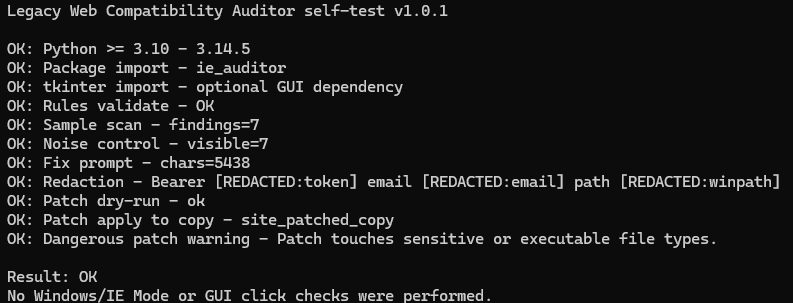
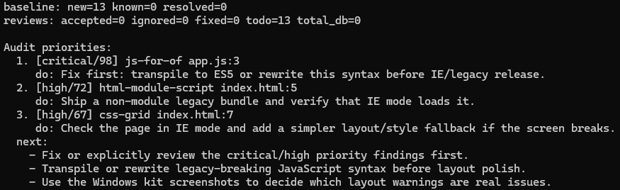
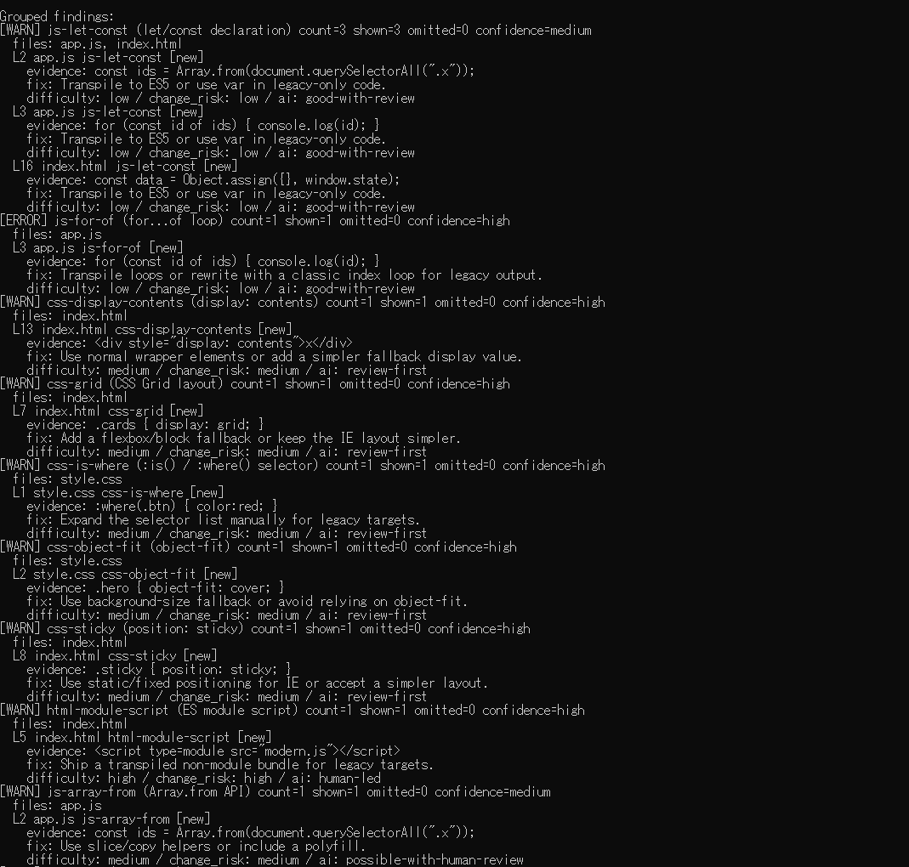
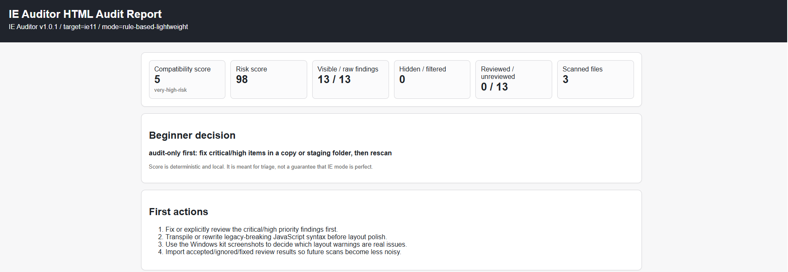

# Legacy Web Compatibility Auditor Pro — Sample

> **購入前の動作確認用サンプルページです。**
> 製品本体は [BOOTH 商品ページ](https://legacy-web-tools.booth.pm/items/8494116) からご購入いただけます。

---

## リンク

| | URL |
|---|---|
| 🌐 製品紹介ページ（GitHub Pages） | https://rukuruku447-ops.github.io/legacy-web-compatibility-auditor-sample/ |
| 🛒 BOOTH 販売ページ ¥9,800 | https://legacy-web-tools.booth.pm/items/8494116 |
| 📝 Qiita 記事 | https://qiita.com/Legacy_Web_Tools/items/dfaec015499491e13d69 |

---

## このリポジトリについて

**Legacy Web Compatibility Auditor Pro** は、IE11 / Edge Legacy などのレガシーブラウザ非互換箇所を自動検出する Python 製 CLI ツールです。

- AI API 不要・外部通信なし（完全ローカル動作）
- 追加ライブラリのインストール不要（`dependencies = []`）
- Python 3.10+ / Windows・Mac・Linux 対応

---

## サンプル成果物

### `sample_report.html` — HTML 監査レポート

[→ sample_report.html をブラウザで開く](./sample_report.html)

サンプルプロジェクト（`const` / `fetch` / `Object.assign` などを含む HTML+JS）を IE11 向けにスキャンした実行結果です。

このレポートは以下のコマンド 1 行で生成されます:

```bash
py -m ie_auditor audit-html ./my_project --target ie11 --out report.html
```

---

## 主な機能

| 機能 | 説明 |
|------|------|
| `scan` | IE11 / Edge Legacy 非互換箇所を検出してターミナルに表示 |
| `audit-html` | 自己完結型 HTML レポートを生成 |
| `compat-report` | 互換性スコア・改善価値レポートを生成 |
| `patch-dry-run` | AI の提案パッチを安全にプレビュー |
| `patch-apply-copy` | 元プロジェクトを変更せずコピーにパッチ適用 |
| `self-test` | 動作確認を自動実行 |

---

## 検出できる問題の例

- `const` / `let` / Arrow function（IE11 非対応）
- `fetch` API（ポリフィルなし使用）
- `Object.assign` / `Array.from`（IE11 非対応）
- CSS Grid / Flexbox の IE11 非対応プロパティ
- ES6 モジュール / テンプレートリテラル
- その他 50+ ルール対応

---

## スクリーンショット

### self-test 実行結果（動作確認）


### scan コマンド — サマリー


### scan コマンド — 検出一覧


### HTML 監査レポート（ブラウザ表示）


---

## 製品購入

**BOOTH 商品ページ** → [https://legacy-web-tools.booth.pm/items/8494116](https://legacy-web-tools.booth.pm/items/8494116)

---

## ライセンス

このサンプルリポジトリ自体は閲覧・共有自由です。
製品本体のコード・ドキュメントの再配布は禁止です（[BOOTH 商品ページ](https://legacy-web-tools.booth.pm/items/8494116) の利用規約をご確認ください）。
